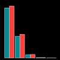

# rawDiag 



an R package supporting rational LC-MS method optimization for bottom-up proteomics on multiple OS platforms

main features:
 
1. **multiplatform** and **fast** reading through using [The New RawFileReader from Thermo Fisher Scientific](http://planetorbitrap.com/rawfilereader).
2. uses latest visualization generation through using Rs [ggplot2](https://cran.r-project.org/package=ggplot2) package.
3. provides an R interface to your instrument raw data.
4. ships with an example [shiny application](http://fgcz-ms-shiny.uzh.ch:8080/bfabric_rawDiag/).


## 1. System Requirements  

A Windows/Linux/MacOSX x64 platform.


### 1.1 .NET framework

- Linux and MacOSX: https://www.mono-project.com/ (>4.0.22)
- MS Windows: [MS .NET Framework](https://dotnet.microsoft.com/download) or higher

### 1.2 R

You need the [R software invorenment](https://www.r-project.org/) for statistical computing.

- if you want support for [Open File Standards](http://www.psidev.info/) install the [mzR](http://bioconductor.org/packages/mzR/) package. 
- U.S. language setting on windows/linux/apple [see issue 33](https://github.com/fgcz/rawDiag/issues/33)


### 1.3 Platforms and R versions the package has been tested on

The package [JPR.R1](https://github.com/fgcz/rawDiag/tree/JPR.R1) release has been tested on the following platforms using [RStudio](https://www.rstudio.com/):

|platform|platform version|R version|note|
| :------- |:--------------|:------|:------- |
|Linux| Debian 8 (jessie) |  3.4.3 | [Demo system](http://fgcz-ms-shiny.uzh.ch:8080/bfabric_rawDiag/)|
|Linux     | Debian 10 ([buster](https://www.debian.org/releases/testing/releasenotes)) | 3.5.0 | CP |
|Linux| bioconductor/devel_proteomics2| 2017-12-31 r73996 | [dockerhub](https://hub.docker.com/r/cpanse/rawdiag/builds/) |
|Windows   | 7 x64| 3.4.1 |CT|
|Windows   | 10 x64| 3.4.4 |CP virtual box|
|Windows   | Server 2012 R2 x64 | 3.4.4|CP|
|Windows   | 10 x64 | 3.4.3 | WEW |
|Windows   | 10 x64 | R Open 3.5.0 | WEW |
|Windows   | 12    | 4.0.0 | CP [see also #56](https://github.com/fgcz/rawDiag/issues/56) |
|MacOSX    | 10.13.5 (17F77)|3.4.2|CP|
|MacOSX    | 10.11.6 (15G20015)|3.4.3 |JG|
|MacOSX    | 10.13.4 (17E202)|3.4.4|CP|

## 2. Installation guide

**Please check the above installation [requirements](README.md#1-system-requirements)!**

#### 2.1 Current release

Please install the **latest release** from [https://github.com/fgcz/rawDiag/releases] according to the provided instructions.

#### 2.2 From GitHub source

The following code downloads and installs the R package from GitHub without the required third party libraries.

```{r}
# install.packages("devtools")
library("devtools")
devtools::install_github("fgcz/rawDiag", build_vignettes = FALSE)
```
**!!! Use this option only if you know what you are doing !!!**

## 3. Demonstration

### 3.1. R commandline code snippet

"Hello; World!" example on the R command line

```{r}
library(rawDiag)
data(WU163763)
PlotScanFrequency(WU163763, method='overlay')
PlotPrecursorHeatmap(WU163763)
PlotMassDistribution(WU163763)
```

### 3.2. An interactive shiny example

#### in your local R shell
```{r}
# install.packages("shiny")
# install.packages("DT")
library(shiny)
rawDiag_shiny <- system.file('shiny', 'demo', package = 'rawDiag')
shiny::runApp(rawDiag_shiny, display.mode = 'normal')
```

#### using the docker image

source: [dockerhub](https://hub.docker.com/r/cpanse/rawdiag/)

```
docker pull cpanse/rawdiag \
&& docker run -it -p 8787:8787 cpanse/rawdiag R -e "library(shiny); \
   rawDiag_shiny <- system.file('shiny', 'demo', package = 'rawDiag'); \
   shiny::runApp(rawDiag_shiny, display.mode = 'normal', port=8787, host='0.0.0.0')"
```

connect with your web browser to `http://yourdockerhostname:8787`

### 3.3. using the `read.raw` method

taken from the `?read.raw` man page.
```{r}
(rawfile <- file.path(path.package(package = 'rawDiag'), 'extdata', 'sample.raw'))
system.time(RAW <- read.raw(file = rawfile))
 
summary.rawDiag(RAW)
PlotScanFrequency(RAW)
     
dim(RAW)
# now  read all dimensions
RAW <- read.raw(file = rawfile, rawDiag = FALSE)
dim(RAW)
INFO <- read.raw.info(rawfile)
head(INFO$`General File Information`)
```

### 3.4. FAQ


#### 3.4.1. I would like to load multiple files into a single `data.frame` to do comparisons; what is the preferred method for doing so?

```{r}
library(parallel)
library(rawDiag)

# consider all raw files of your working dir
rawFileNames <- list.files()[grep("raw$", list.files())]

# read all the meta data using 4 cores
RAW <- mclapply(rawFileNames, read.raw, mc.cores=4)
# as alternative  \code{lapply} instread of \code{mclapply}

# concatenate the list data.frames into one single one
RAW <- plyr::rbind.fill(RAW)
```


#### 3.4.2. Can I run the rawDiag shiny code as a stand-alone application?

run the rawDiag shiny application

```{r}
library(rawDiag)

# root defines where your raw files are
rawDiagShiny(root="D:/Data2San/")
```

Yes, on Microsoft's systems call (through using `cmd.exe`)
```
"c:\Program Files\R\R-3.5.1\bin\R.exe" -e "library(rawDiag); rawDiagShiny(root='D:/Downloads', launch.browser=TRUE)"
```
expecting the raw files in the `Downloads` folder.

using Linux and Apple systems use the `Terminal` application and type
```{bash}
R -e "library(rawDiag); rawDiagShiny(root='$HOME/Downloads', launch.browser=TRUE)"
```

and you can add to your alias file, e.g., `$HOME/.bashrc`
```
alias rawDiag="R -e \"library(rawDiag); rawDiagShiny(root='$HOME/Downloads', launch.browser=TRUE)\""
```

#### 3.4.3  How to get all scan attributes assosiated to each scan?

Assuming the raw file name is equal to "20181217_006_autoQC01.raw" the command would be:
```
AllScanMetaData <- read.raw("20181217_006_autoQC01.raw", rawDiag = FALSE)
> dim(AllScanMetaData)
[1] 21868    82
> names(AllScanMetaData)
 [1] "filename"               "scanNumber"             "ScanEventNumber"       
 [4] "StartTime"              "BasePeakMass"           "BasePeakIntensity"     
 [7] "TIC"                    "ScanType"               "CycleNumber"           
[10] "Frequency"              "HighMass"               "IonizationMode"        
[13] "MSOrder"                "MassAnalyzer"           "Detector"              
[16] "Lock"                   "PrecursorMass"          "LastPrecursorMass"     
[19] "CollisionEnergy"        "IsolationWidth"         "MultipleInjection"     
[22] "MultiInjectInfo"        "AGC"                    "MicroScanCount"        
[25] "ScanSegment"            "ScanEvent"              "MasterIndex"           
[28] "ChargeState"            "MonoisotopicmZ"         "IonInjectionTimems"    
[31] "MaxIonTimems"           "FTResolution"           "MS2IsolationWidth"     
[34] "MS2IsolationOffset"     "AGCTarget"              "HCDEnergy"             
[37] "AnalyzerTemperature"    "MassCalibration"        "ConversionParameterB"  
[40] "ConversionParameterC"   "TemperatureCompppm"     "RFCompppm"             
[43] "SpaceChargeCompppm"     "ResolutionCompppm"      "NumberofLockMasses"    
[46] "LockMass1mZ"            "LockMass2mZ"            "LockMass3mZ"           
[49] "LMSearchWindowppm"      "LMSearchWindowmmu"      "NumberofLMFound"       
[52] "LastLockingsec"         "LMmZCorrectionppm"      "IonOpticsSettings"     
[55] "SLensRFLevel"           "SLensVoltageV"          "SkimmerVoltageV"       
[58] "InjectFlatapoleOffsetV" "BentFlatapoleDCV"       "MP2andMP3RFV"          
[61] "GateLensVoltageV"       "CTrapRFV"               "DiagnosticData"        
[64] "DynamicRTShiftmin"      "IntensCompFactor"       "ResDepIntens"          
[67] "CTCDNumF"               "CTCDComp"               "CTCDScScr"             
[70] "RawOvFtT"               "LCFWHMparameter"        "Rod"                   
[73] "PSInjTimems"            "AGCPSMode"              "AGCPSDiag"             
[76] "HCDEnergyeV"            "AGCFill"                "Injectiont0"           
[79] "t0FLP"                  "AccessId"               "AnalogInput1V"         
[82] "AnalogInput2V"         
```

#### 3.4.4 How to read a large number of MS2 scans?

apply the *divide-and-conquer* algorithm design paradigm 

```{r}
stopifnot(require(rawDiag))
stopifnot(require(parallel))

chunk <- function(x,n) split(x, factor(sort(rank(x)%%n)))
# input: is a given integer vecor of MS2 scanNumber and the raw file name
# output: list of MS2 scans 
MS2 <- mclapply(chunk(scanNumberMs2, 100), 
  function(scans){readScans(rawfilename, scans=scans)}, 
	mc.cores=16)
```

## 4. Instructions for use

read the vignettes.

```{r}
browseVignettes('rawDiag')
```

the documentation of the functions is available through the R man pages.

## 5. Useful bookmarks

- vignette on [reading MS/MS2 and extracting XIC example](http://fgcz-ms.uzh.ch/~cpanse/rawDiagXICdemo.pdf) using the `rawDiag::readScans` and `rawDiag::readXICs`functions; [replication code](https://github.com/fgcz/rawDiag/blob/master/vignettes/XIC.Rmd).

- [bioRxiv 304485](https://www.biorxiv.org/content/early/2018/04/24/304485) rawDiag manuscript. Now published in [Journal of Proteome Research doi: 10.1021/acs.jproteome.8b00173](http://dx.doi.org/10.1021/acs.jproteome.8b00173).

- Proteomics Forum 2019 poster [](https://doi.org/10.5281/zenodo.2640013) and [replication code](vignettes/ProteomicsForum2019_P55.Rnw).

- EuroBioc2018 slides as  [PDF](http://fgcz-ms.uzh.ch/~cpanse/talks/rawDiag_EuroBioc2018_Munich_20181206.pdf) (8.5M, md5=cb8da7f05cb6ab197a9339db477e0887).

- ASMS 2018 poster as [PDF](https://github.com/fgcz/rawDiag/files/3000372/ASMS2018_ID291250.pdf) (1.8M, md5=dab9388c1a465d931e9d2345119a2827).

- use [rawDiag shiny demonstration on our compute server](http://fgcz-ms-shiny.uzh.ch:8080/bfabric_rawDiag/) hosted @ UZH.

- example data on [MassIVE MSV000082389](https://massive.ucsd.edu/ProteoSAFe/dataset.jsp?task=b231e78d674345798ebe50e46a9a3a93).

- source code: [https://fgcz.github.io/rawDiag/](https://fgcz.github.io/rawDiag/).

- [screen recording (3:02 minutes, size 47MB, no audio track)](http://fgcz-ms.uzh.ch/~cpanse/manuscripts//pr-2018-001736.mov).

- [New RawFileReader from Thermo Fisher Scientific](http://planetorbitrap.com/rawfilereader).


## 6. See also 

- ThermoRawFileParser: modular, scalable and cross-platform RAW file conversion
	- https://www.biorxiv.org/content/10.1101/622852v1.abstract
- MARMoSET – Extracting Publication-Ready Mass Spectrometry Metadata from RAW Files
	- https://doi.org/10.1074/mcp.TIR119.001505
	- C# code https://github.molgen.mpg.de/loosolab/MARMoSET_C
	
